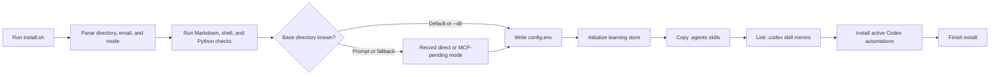
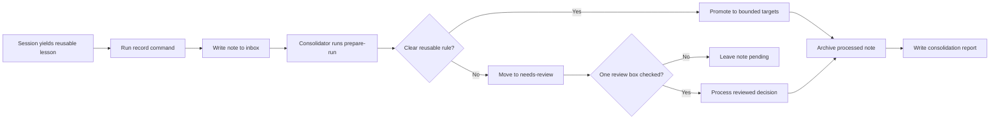
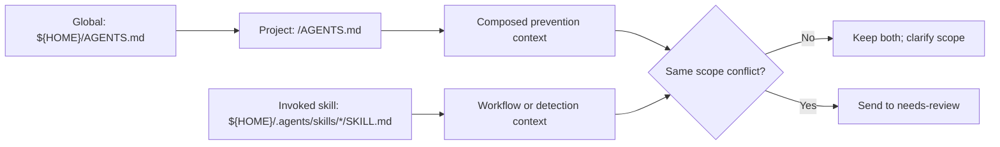
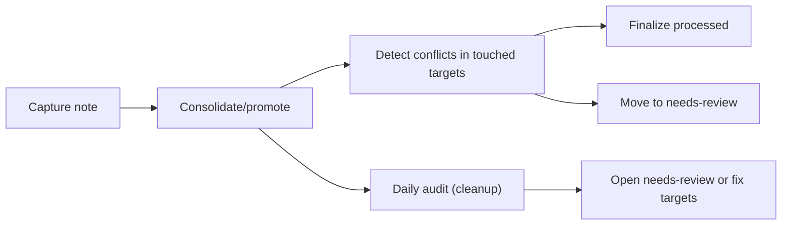
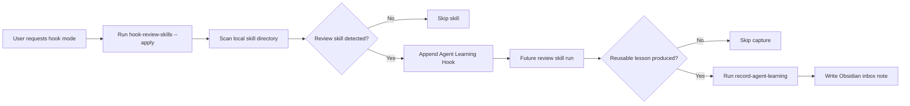
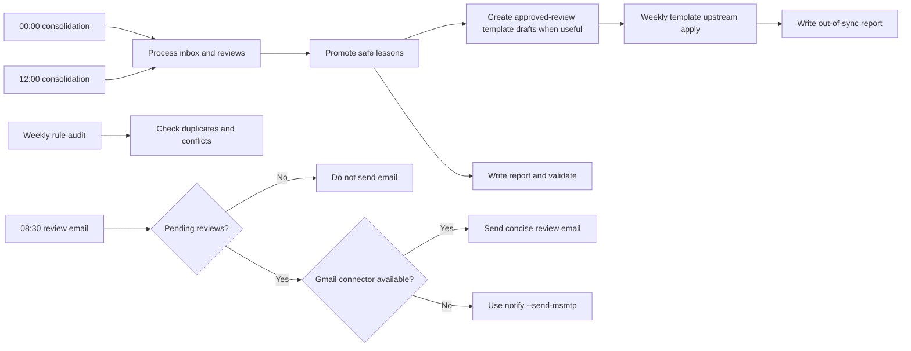

# Agent Learning System

Local Codex skills and automations for capturing real debugging and review
learnings, storing them in a filesystem-backed Markdown tree, and promoting
reusable lessons into agent instructions and review skills.

## Table of Contents

- [Purpose](#purpose)
- [Repository Layout](#repository-layout)
- [Install](#install)
- [Full Pipeline Setup](#full-pipeline-setup)
- [Learning Store](#learning-store)
- [Instruction and Skill Context](#instruction-and-skill-context)
- [Conflict Detection Levels](#conflict-detection-levels)
- [Architecture](#architecture)
- [Skills](#skills)
- [Review Skill Hooks](#review-skill-hooks)
- [Automations](#automations)
- [Validation](#validation)

## Purpose

The system keeps learning lightweight and auditable:

- session-level findings are recorded as Obsidian notes;
- processed notes are kept as history, not deleted;
- daily consolidation reads only new inbox notes and review decisions;
- reusable lessons are promoted to the smallest useful target;
- no repository is committed or pushed automatically.

## Repository Layout

```text
.
├── README.md
├── CHANGELOG.md
├── AGENTS.md
├── config.example.env
├── install.sh
├── automations/
│   ├── midnight-consolidation.md
│   ├── morning-review-email.md
│   ├── noon-consolidation.md
│   ├── template-weekly-upstream-apply.md
│   └── weekly-rule-audit.md
├── docs/
│   ├── auto-learning-pipeline-automations.md
│   └── composable-learning-architecture.md
├── scripts/
│   └── agent_learning.py
├── skills/
│   ├── consolidate-agent-learnings/
│   └── record-agent-learning/
└── tests/
    └── test_agent_learning.py
```

## Install

Run:

```bash
./install.sh
```

The installer:

- detects the active Obsidian vault as a convenient default filesystem path;
- writes `~/.config/agent-learning-system/config.env`;
- creates the learning store folders;
- copies both skills into `~/.agents/skills`;
- links `~/.codex/skills` to the installed `~/.agents/skills` copies;
- installs or updates the daily Codex automations as active;
- validates Markdown, shell, and Python files.

Pass `--dir PATH` to choose any filesystem directory as the learning-store base.
The store itself is created as `PATH/AI Agent Learnings/`. If `PATH` is inside
an Obsidian vault, Obsidian will show the Markdown notes automatically; no
Obsidian API or MCP server is required.

Pass `--skip-automations` if you only want to install config and skills. If the
Obsidian provider is `mcp-pending`, automation installation is skipped until
direct filesystem access or a working MCP setup is configured.

Pass `--email ADDRESS` before relying on the morning review email. Without it,
the installer records a reserved example address and the morning notification
flow will not send mail.

If the default Obsidian vault is not found, the installer asks for a direct
filesystem directory path or records MCP mode as pending. Direct filesystem
access is the recommended mode for this project because the automation only
needs local Markdown files.

This setup flow follows `install.sh`, including validation, config creation,
skill copy installation, Codex mirrors, automation records, and final local
checks.



## Full Pipeline Setup

For the complete two-repository auto-learning pipeline, install this repository
and the template repository, then ensure the weekly audit and template upstream
automations exist.

Follow
[`docs/auto-learning-pipeline-automations.md`](docs/auto-learning-pipeline-automations.md)
when asking an AI agent to create or repair the Codex automations. The runbook
covers:

| Component | Repo |
| --- | --- |
| Daily note consolidation | `agent-learning-system` |
| Morning review notification | `agent-learning-system` |
| Weekly duplicate and conflict audit | `agent-learning-system` |
| Approved template draft apply | `agents-file-templates-and-skills` |
| Generated-project refresh reports | `agents-file-templates-and-skills` |

## Learning Store

The canonical archive lives under `AGENT_LEARNING_DIR` plus
`AGENT_LEARNING_STORE_NAME`.

Example:

```env
AGENT_LEARNING_DIR="/any/filesystem/folder"
AGENT_LEARNING_STORE_NAME="AI Agent Learnings"
```

This creates:

```text
/any/filesystem/folder/AI Agent Learnings/
├── inbox/
├── needs-review/
├── processed/YYYY/MM/
├── reports/
└── state/
    └── processed.json
```

`AGENT_LEARNING_DIR` may be any local filesystem directory. When it points at an
Obsidian vault, Obsidian sees the generated Markdown files as normal notes.

> Source: `scripts/agent_learning.py` commands `record`, `prepare-run`,
> `finalize-note`, `write-report`, `summarize-runs`, and
> `create-template-draft`.



Review notes contain a stable checkbox block:

```markdown
## Review Decision

<!-- BEGIN AGENT LEARNING REVIEW -->
- [ ] Approve: promote this rule
- [ ] Retry: I edited the rule, reprocess it
- [ ] Reject: do not promote this rule
<!-- END AGENT LEARNING REVIEW -->
```

The consolidator reads `inbox/`, `needs-review/`, and `state/processed.json`.
It does not reread `processed/` history unless resolving a duplicate or
conflict.

## Instruction and Skill Context



Project instructions and global instructions are prevention context when they
are loaded before the agent acts. Skills are workflow context: they can be
prevention only when the failing agent would normally invoke that skill before
acting.

## Conflict Detection Levels



The system currently supports a periodic audit via `audit-rules` (see below).

## Architecture

The routing model is documented in
[`docs/composable-learning-architecture.md`](docs/composable-learning-architecture.md).
That document defines prevention targets, detection targets, recurrence
tracking, and draft-first upstreaming into reusable instruction templates.

## Skills

### `record-agent-learning`

Use after a session produces a real reusable finding, fix, regression, or
workflow correction. It writes one structured note to `inbox/`.

It also has an explicit hook mode for user-requested setup. Hook mode scans the
local skill directory for review-oriented skills and appends an idempotent
`Agent Learning Hook` section to each detected target. It does not run during
ordinary one-off capture.

### `consolidate-agent-learnings`

Use from scheduled automation or manually when promoting learning notes. It
classifies new notes, handles reviewed checkbox decisions, promotes strong
lessons, moves notes, writes reports, and validates changed files.

Consolidations should follow the routing contract in
[`docs/composable-learning-architecture.md`](docs/composable-learning-architecture.md#required-routing-contract)
so reports distinguish prevention targets from detection targets. Pass
`--enforce-routing` when finalizing promoted lessons that should have a
prevention target.

Create draft-first template handoffs with `create-template-draft`, then review
them in the template repository before curated atom edits.

Measure recurrence and routing gaps with:

```bash
python3 scripts/agent_learning.py summarize-runs --since "2026-06-01"
```

### `audit-rules`

Scan promoted targets (default: `$HOME/AGENTS.md` and `$HOME/.agents/skills/**`)
for duplicate or potentially conflicting bullets.

```bash
python3 scripts/agent_learning.py audit-rules
```

Limit the scan to a specific directory or file:

```bash
python3 scripts/agent_learning.py audit-rules --path /path/to/dir-or-file
```

## Review Skill Hooks

Preview detected review skills:

```bash
python3 scripts/agent_learning.py hook-review-skills \
  --skills-dir "${HOME}/.agents/skills"
```

Install the hook only after explicitly choosing to attach learning capture to
review skills:

```bash
python3 scripts/agent_learning.py hook-review-skills \
  --skills-dir "${HOME}/.agents/skills" \
  --apply
```

When a review skill has a separate repository source, also pass that repository
skill directory:

```bash
python3 scripts/agent_learning.py hook-review-skills \
  --skills-dir "${HOME}/.agents/skills" \
  --repo-skills-dir "/path/to/repository/skills" \
  --apply
```

The command detects review skills from their frontmatter and early workflow
text. It skips `record-agent-learning` and `consolidate-agent-learnings`, avoids
duplicate hooks, updates the installed local copy, and updates a matching
repository source when `--repo-skills-dir` is provided.

This hooked-review flow starts only from an explicit hook-mode request and then
changes future review workflows.



## Automations

The active Codex automations should use the prompt files under `automations/`:

- `agent-learning-midnight-consolidation` at `00:00` Europe/Rome;
- `agent-learning-morning-review-email` at `08:30` Europe/Rome;
- `agent-learning-noon-consolidation` at `12:00` Europe/Rome;
- `agent-learning-weekly-rule-audit` weekly before template apply;
- `agent-template-weekly-upstream-apply` weekly in the template repository.

These automations are stored under `~/.codex/automations/` after Codex creates
them. The shell installer also writes these records directly so a normal
`./install.sh` run activates the daily loop without a separate manual Codex
step. Use
[`docs/auto-learning-pipeline-automations.md`](docs/auto-learning-pipeline-automations.md)
for the full two-repository setup.

This automation flow follows the prompt files in `automations/` and the
notification behavior in `scripts/agent_learning.py notify`.



The email automation tries the Gmail connector first. If it is unavailable, it
uses the local `msmtp` fallback through `scripts/agent_learning.py notify`.

## Validation

Run:

```bash
markdownlint --config ~/.markdownlint.json AGENTS.md CHANGELOG.md README.md docs/*.md skills/**/*.md automations/*.md
shellcheck --enable=all install.sh
python3 -m py_compile scripts/agent_learning.py tests/test_agent_learning.py
python3 -m unittest discover -s tests
```
