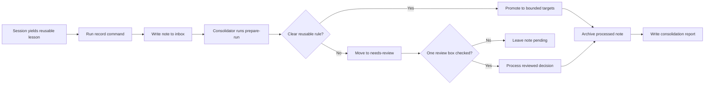
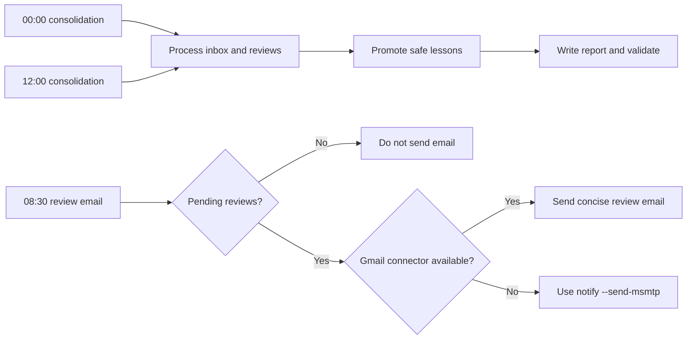

# Agent Learning System

Local Codex skills and automations for capturing real debugging and review
learnings, storing them in Obsidian, and promoting reusable lessons into agent
instructions and review skills.

## Table of Contents

- [Purpose](#purpose)
- [Repository Layout](#repository-layout)
- [Install](#install)
- [Obsidian Workflow](#obsidian-workflow)
- [Skills](#skills)
- [Automations](#automations)
- [Validation](#validation)

## Purpose

The system keeps learning lightweight and auditable:

- session-level findings are recorded as Obsidian notes;
- processed notes are kept as history, not deleted;
- daily consolidation reads only new inbox notes and review decisions;
- reusable lessons are promoted to the smallest useful target;
- no repository is committed or pushed automatically.

## Repository Layout

```text
.
├── README.md
├── CHANGELOG.md
├── AGENTS.md
├── config.example.env
├── install.sh
├── automations/
│   ├── midnight-consolidation.md
│   ├── morning-review-email.md
│   └── noon-consolidation.md
├── scripts/
│   └── agent_learning.py
├── skills/
│   ├── consolidate-agent-learnings/
│   └── record-agent-learning/
└── tests/
    └── test_agent_learning.py
```

## Install

Run:

```bash
./install.sh
```

The installer:

- detects the active Obsidian vault;
- writes `~/.config/agent-learning-system/config.env`;
- creates the Obsidian learning folders;
- installs both skills into `~/.agents/skills` and `~/.codex/skills`;
- installs or updates the three Codex automations as active;
- validates Markdown, shell, and Python files.

Pass `--skip-automations` if you only want to install config and skills. If the
Obsidian provider is `mcp-pending`, automation installation is skipped until
direct vault access or a working MCP setup is configured.

Pass `--email ADDRESS` before relying on the morning review email. Without it,
the installer records a reserved example address and the morning notification
flow will not send mail.

If the default Obsidian vault is not found, the installer asks for a direct
vault path or records MCP mode as pending. Direct filesystem access is the
recommended mode for this project because the automation only needs local
Markdown files.

This setup flow follows `install.sh`, including validation, config creation,
skill installation, Codex mirrors, automation records, and final local checks.

```mermaid
flowchart LR
  accTitle: Install setup flow
  accDescr: Shows how install.sh resolves config, installs skills, and validates.
  start["Run install.sh"] --> parse["Parse vault, email, and mode"]
  parse --> validate["Run Markdown, shell, and Python checks"]
  validate --> vault{"Vault path known?"}
  vault -->|Default or --vault| config["Write config.env"]
  vault -->|Prompt or fallback| pending["Record direct or MCP-pending mode"]
  pending --> config
  config --> store["Initialize Obsidian store"]
  store --> install["Install .agents skills"]
  install --> mirror["Link .codex skill mirrors"]
  mirror --> automations["Install active Codex automations"]
  automations --> done["Finish install"]
```



## Obsidian Workflow

The canonical archive lives under the configured vault:

```text
AI Agent Learnings/
├── inbox/
├── needs-review/
├── processed/YYYY/MM/
├── reports/
└── state/
    └── processed.json
```

This lifecycle follows the `record`, `prepare-run`, `finalize-note`, and
`write-report` commands in `scripts/agent_learning.py`.



Review notes contain a stable checkbox block:

```markdown
## Review Decision

<!-- BEGIN AGENT LEARNING REVIEW -->
- [ ] Approve: promote this rule
- [ ] Retry: I edited the rule, reprocess it
- [ ] Reject: do not promote this rule
<!-- END AGENT LEARNING REVIEW -->
```

The consolidator reads `inbox/`, `needs-review/`, and `state/processed.json`.
It does not reread `processed/` history unless resolving a duplicate or
conflict.

## Skills

### `record-agent-learning`

Use after a session produces a real reusable finding, fix, regression, or
workflow correction. It writes one structured note to `inbox/`.

### `consolidate-agent-learnings`

Use from scheduled automation or manually when promoting learning notes. It
classifies new notes, handles reviewed checkbox decisions, promotes strong
lessons, moves notes, writes reports, and validates changed files.

## Automations

The active Codex automations should use the prompt files under `automations/`:

- `agent-learning-midnight-consolidation` at `00:00` Europe/Rome;
- `agent-learning-morning-review-email` at `08:30` Europe/Rome;
- `agent-learning-noon-consolidation` at `12:00` Europe/Rome.

These automations are stored under `~/.codex/automations/` after Codex creates
them. The shell installer also writes these records directly so a normal
`./install.sh` run activates the daily loop without a separate manual Codex
step.

This automation flow follows the prompt files in `automations/` and the
notification behavior in `scripts/agent_learning.py notify`.



The email automation tries the Gmail connector first. If it is unavailable, it
uses the local `msmtp` fallback through `scripts/agent_learning.py notify`.

## Validation

Run:

```bash
markdownlint --config ~/.markdownlint.json AGENTS.md CHANGELOG.md README.md skills/**/*.md automations/*.md
shellcheck --enable=all install.sh
python3 -m py_compile scripts/agent_learning.py tests/test_agent_learning.py
python3 -m unittest discover -s tests
```
