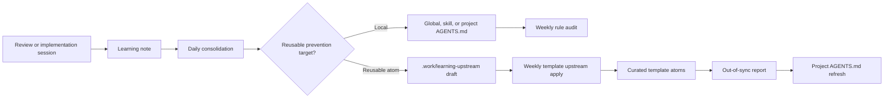

# Auto-Learning Pipeline Automations

This runbook is for an AI agent installing or repairing the complete
auto-learning pipeline across `agent-learning-system` and
`agents-file-templates-and-skills`.

## Table of Contents

- [Scope](#scope)
- [Pipeline Map](#pipeline-map)
- [Required Automations](#required-automations)
- [Install Checklist](#install-checklist)
- [Validation](#validation)
- [Failure Controls](#failure-controls)

## Scope

The full pipeline needs both repositories:

| Repository | Responsibility |
| --- | --- |
| `${HOME}/Development/agent-learning-system` | Record notes, consolidate reviews, route prevention targets, create template drafts, audit installed rules |
| `${HOME}/Development/agents-file-templates-and-skills` | Review approved drafts, update curated atoms, report projects that need refreshed generated instructions |

Use `${HOME}` in prompts and docs. The Codex scheduler may store resolved local
workspace paths internally, but repository documentation must not hard-code a
personal home path.

## Pipeline Map



## Required Automations

| Automation ID | Cwd | Cadence | Prompt Source | Purpose |
| --- | --- | --- | --- | --- |
| `agent-learning-midnight-consolidation` | `agent-learning-system` | Daily at midnight | `automations/midnight-consolidation.md` | Process inbox and reviewed notes |
| `agent-learning-noon-consolidation` | `agent-learning-system` | Daily at noon | `automations/noon-consolidation.md` | Catch daytime notes and reviewed decisions |
| `agent-learning-morning-review-email` | `agent-learning-system` | Daily morning | `automations/morning-review-email.md` | Notify only when `needs-review/` has work |
| `agent-learning-weekly-rule-audit` | `agent-learning-system` | Weekly before template apply | `automations/weekly-rule-audit.md` | Detect duplicate, conflicting, or bloated installed rules |
| `agent-template-weekly-upstream-apply` | `agents-file-templates-and-skills` | Weekly after rule audit | `automations/template-weekly-upstream-apply.md` | Apply only approved clean template drafts and write refresh reports |

The learning installer writes the daily learning automations. The weekly rule
audit and template upstream automation are Codex automations that an agent
should create or update explicitly if missing.

## Install Checklist

1. Verify both repositories exist:

   ```bash
   test -d "${HOME}/Development/agent-learning-system"
   test -d "${HOME}/Development/agents-file-templates-and-skills"
   ```

2. Install or refresh the learning system:

   ```bash
   cd "${HOME}/Development/agent-learning-system"

   set -a
   . "${HOME}/.config/agent-learning-system/config.env"
   set +a

   ./install.sh \
     --dir "${AGENT_LEARNING_DIR}" \
     --email "${AGENT_LEARNING_EMAIL}" \
     --email-provider "${AGENT_LEARNING_EMAIL_PROVIDER}"
   ```

   If the config file does not exist, run `./install.sh` with explicit
   `--dir`, `--email`, and `--email-provider` values. Prefer direct filesystem
   access to the learning store.

3. Install or refresh the template skills:

   ```bash
   cd "${HOME}/Development/agents-file-templates-and-skills"
   make install AGENTS="openai"
   ```

   Add other agents only when the user asks for them. Use `make install-symlink`
   when installed skills should point back to the checkout.

4. Inspect existing Codex automations before creating anything:

   ```bash
   find "${CODEX_HOME:-${HOME}/.codex}/automations" \
     -maxdepth 2 \
     -name automation.toml \
     -print

   rg -n "agent-learning|learning-upstream|template-upstream" \
     "${CODEX_HOME:-${HOME}/.codex}/automations" \
     -g automation.toml
   ```

5. In Codex Desktop, use the automation tool to create or update missing
   automations from [Required Automations](#required-automations).

   Use these rules:

   - prefer updating an existing matching automation over creating a duplicate;
   - use `local` execution for these jobs;
   - use the matching repository as the automation cwd;
   - keep active jobs `ACTIVE`;
   - preserve existing model and reasoning settings unless they are clearly
     wrong;
   - load prompt text from the prompt source files above;
   - do not hand-edit scheduler records except through `install.sh` for the
     daily learning automations.

6. Ensure the template weekly job keeps curated edits gated:

   ```text
   summary -> inspect drafts -> dry run approved clean drafts -> apply ->
   validate -> out-of-sync report
   ```

   It must not apply draft, blocked, needs-scrub, duplicate-looking, private, or
   unreviewed handoffs.

## Validation

After setup, verify the learning side:

```bash
cd "${HOME}/Development/agent-learning-system"
python3 scripts/agent_learning.py init-store
python3 scripts/agent_learning.py prepare-run --json
markdownlint --config "${HOME}/.markdownlint.json" \
  AGENTS.md CHANGELOG.md README.md docs/*.md skills/**/*.md automations/*.md
shellcheck --enable=all install.sh
python3 -m py_compile scripts/agent_learning.py tests/test_agent_learning.py
python3 -m unittest discover -s tests
```

Verify the template side:

```bash
cd "${HOME}/Development/agents-file-templates-and-skills"
python3 skills/update-agents-file-templates/scripts/update_agents_templates.py \
  --template-repo . \
  --learning-upstream-summary
python3 skills/update-agents-file-templates/scripts/update_agents_templates.py \
  --template-repo . \
  --scan-root "${HOME}/Development" \
  --out-of-sync-report
make validate
```

## Failure Controls

| Failure | Control |
| --- | --- |
| Duplicate automation | Search existing automation records before create |
| Learning notes never affect templates | Confirm `create-template-draft` runs during consolidation and the weekly template job exists |
| Template edits leak private data | Require `Privacy verdict: clean` and run `scripts/privacy_scan.py` |
| Templates change without review | Weekly template job applies only `approved` and `clean` drafts |
| Same mistake repeats after promotion | Check weekly rule audit plus `summarize-runs` recurrence output |
| Generated projects go stale | Review `.work/out-of-sync/` after template apply |
| Automation commits unexpectedly | Prompt every automation with no stage, commit, push, or PR side effects |
