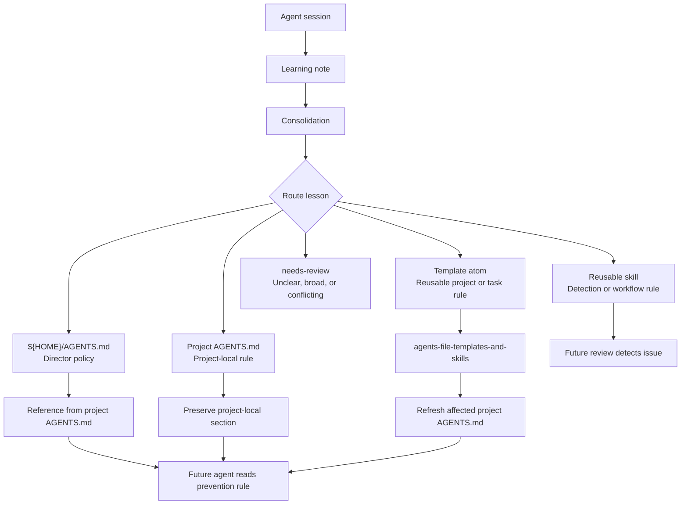
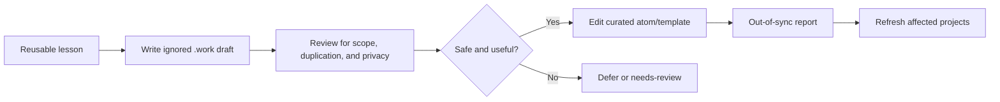

# Composable Learning Architecture

This document defines how the learning loop should improve live instructions,
project instructions, reusable skills, and template atoms without duplicating
rules.

## Table of Contents

- [Goal](#goal)
- [System Map](#system-map)
- [Routing Rule](#routing-rule)
- [Targets](#targets)
- [Required Routing Contract](#required-routing-contract)
- [Failure Modes](#failure-modes)
- [Template Upstreaming](#template-upstreaming)
- [Recurrence Measurement](#recurrence-measurement)
- [Automation Policy](#automation-policy)

## Goal

The system must promote each real lesson to the place where it can prevent the
same class of mistake before the agent repeats it.

```text
Wrong question: Where can this lesson be documented?
Right question: Where must this lesson live so the failing agent would read it
before acting?
```

Review skills are detection targets. They help catch issues later. Prevention
targets are the files or generated instruction layers an implementation agent
loads before acting.

## System Map



## Routing Rule

Every promoted lesson must answer this routing question:

```text
Would the agent that made the mistake have read the promoted rule before acting?
```

| Answer | Required Action |
| --- | --- |
| Yes | Record the prevention target and rationale. |
| No | Add or propose a prevention target, not only a detection target. |
| Unclear | Move the note to `needs-review/`. |
| Too local | Archive with a project-local rationale or update only project rules. |

## Targets

| Target | Purpose | Use When |
| --- | --- | --- |
| Global director | Universal working style and safety policy | The rule applies across almost every project |
| Template atom | Reusable project-type or task rule | Similar projects should inherit the rule |
| Project `AGENTS.md` | Repo-specific facts and commands | The rule depends on one project |
| Reusable skill | Detection, review, remediation, or workflow behavior | The rule changes how a skill works |
| `needs-review/` | Human decision point | The rule is broad, risky, conflicting, or privacy-sensitive |

Do not treat a review-skill update as prevention unless the failing agent would
normally load that skill before acting.

## Required Routing Contract

The helper commands write these fields and can enforce them with
`--enforce-routing` during finalization or report creation.

Finalized note frontmatter should include:

| Field | Meaning |
| --- | --- |
| `lesson_family` | Stable dedupe identity for recurrence tracking |
| `scope` | `global`, `atom`, `project-local`, `skill-prevention`, `skill-detection`, or `needs-review` |
| `prevention_targets` | JSON list of files or generated layers read before acting |
| `detection_targets` | JSON list of review or diagnostic skills that catch the issue later |
| `template_upstream_status` | `not-applicable`, `draft-created`, `promoted`, or `deferred` |
| `routing_rationale` | Why the target can prevent recurrence |

Every consolidation report should include this section:

```markdown
## Routing Decision

- Lesson family: `<stable-family-id>`
- Scope: `<global|atom|project-local|skill-prevention|skill-detection|needs-review>`
- Prevention targets:
  - `<path-or-generated-layer>`
- Detection targets:
  - `<skill-or-workflow>`
- Template upstream status: `<not-applicable|draft-created|promoted|deferred>`
- Routing rationale: `<why the failing agent would read this before acting>`
- Recurrence check: `<new|duplicate-before-promotion|duplicate-after-prevention>`
```

If `prevention_targets` is empty and `scope` is not `skill-detection` or
`needs-review`, the promotion is incomplete.

Use `skill-detection` when the lesson improves a review or diagnostic workflow
but no safe prevention target is known yet. Detection-only lessons must include
a recurrence follow-up so repeated findings can be re-routed to prevention.

## Failure Modes

| Risk | Failure Mode | Prevention |
| --- | --- | --- |
| Wrong target | Rule exists but the failing agent never reads it | Require `prevention_targets` |
| Review-only learning | Review skill catches the issue again | Separate detection from prevention |
| Too broad | Global file becomes noisy | Prefer atoms or project-local rules |
| Too narrow | Same rule is copied into many projects | Promote reusable rules into atoms |
| Conflicting atoms | Combined instructions disagree | Audit composed output before refresh |
| Instruction bloat | Project files become hard to scan | Keep atoms concise and split large atoms |
| Bad lesson | One-off or wrong rule is promoted | Use `needs-review/` and evidence checks |
| Privacy leak | Local paths or private values enter templates | Run privacy scan before template changes |
| False metrics | Duplicate count is misread | Track recurrence by lesson family and time |

## Template Upstreaming

Reusable prevention rules should flow into
`agents-file-templates-and-skills` as draft-first updates.



Draft-first means automation may create `.work/` candidate material, but curated
templates are edited only after review and privacy scrubbing. Draft text must
already be scrubbed; private values are rejected before the draft is written.

The canonical handoff path and fields live in the template repository's
`docs/composable-agent-instructions.md#learning-handoff-format`. This repo owns
the routing decision that creates the draft; the template repository owns the
draft format, privacy review, curation, and project refresh.

Create the ignored handoff draft with:

```bash
python3 scripts/agent_learning.py create-template-draft \
  --template-repo "/path/to/agents-file-templates-and-skills" \
  --lesson-family "markdown-validation-contract" \
  --source-note "/path/to/note.md" \
  --proposed-template "docs" \
  --candidate-rule "Run markdownlint before completing Markdown documentation changes." \
  --prevention-target "atom:docs" \
  --routing-rationale "Documentation agents load the docs atom before editing Markdown." \
  --privacy-verdict clean \
  --enforce-routing
```

The template repository then owns:

| Step | Command |
| --- | --- |
| Summarize drafts | `update_agents_templates.py --learning-upstream-summary` |
| Preview curated apply | `update_agents_templates.py --apply-learning-draft <draft>` |
| Apply approved draft | `update_agents_templates.py --apply-learning-draft <draft> --apply` |
| Report stale projects | `update_agents_templates.py --out-of-sync-report` |

## Recurrence Measurement

The system should measure whether learning improved behavior:

| Metric | Meaning |
| --- | --- |
| Time to process | How long inbox notes wait before consolidation |
| Duplicate before promotion | Normal backlog noise |
| Duplicate after prevention target | Possible routing or rule-quality failure |
| Detection-only recurrence | Review skill works, prevention is missing |
| Project refresh coverage | Which projects received updated atoms |

A repeated lesson after a prevention target exists is not automatically a
failure, but it must be investigated.

Summarize recurrence with:

```bash
python3 scripts/agent_learning.py summarize-runs \
  --since "2026-06-01" \
  --format markdown
```

## Automation Policy

| Automation | Safe Behavior |
| --- | --- |
| Noon and midnight consolidation | Promote bounded lessons and report routing metadata |
| Weekly rule audit | Audit duplicates, conflicts, bloat, and missing prevention targets |
| Template upstream draft | Create ignored `.work/learning-upstream/` drafts only |
| Template curation | Manual or explicitly requested apply step |

No automation should commit, push, or silently edit curated templates without an
explicit apply request.
